# UML图

要学习设计模式，一定要学会画UML图，下面我们用一个例子来解释类的关系以及它们在UML图中表示。

## 一个例子

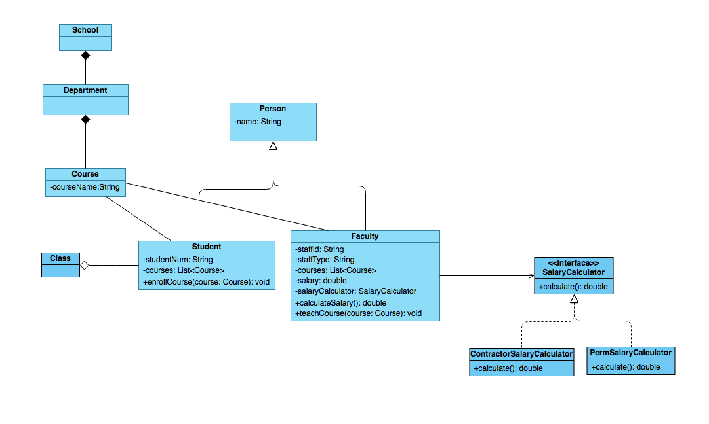

例子中有下面几种关系：

- 学生(Student)和教师(Faculty)继承了人(Person)，它们之间是泛化关系

- `ContractorSalary`和`PermSalary`实现了`Salary`接口，它们之间是实现关系

- 学校(School)和学系(Department)之间是组合关系；学系(Department)和课程(Course)之间也是组合关系

- 班级(Class)和学生(Student)之间是聚合关系

- 课程(Course)和老师(Faculty)之间是关联关系；课程(Course)和学生(Student)之间也是关联关系；教师(Faculty)依赖于`Salary`接口来计算工资，它们之间也是关联关系

这么多种关系，在UML图中都有特定的符号表示，看完下面的具体阐述，再回来看下上面的例子，你会印象更深刻。

## UML表示

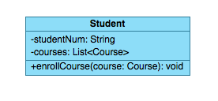

看到该图分为三层：最顶层的为类名，中间层的为属性，最底层的为方法。

变量或方法可见性：`-`表示private，`+`表示public，`#`表示protected

变量的表示方式为：[可见性] [属性名称]：[类型] = {缺省值，可选}

方法的表示方式为：[可见性] [方法名称]（[参数列表]）：[类型] 

为了简单，通常可以省略`setter`和`getter`方法。

## 泛化关系(Generalization)

泛化关系也就是继承关系，是`is-a`的关系，用于描述父类与子类之间的关系。在UML图中，泛化关系用带空心三角形的实线表示。

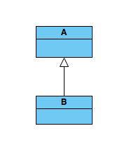

B继承A，即是：`B "is-a" A`。例如：汽车是车、狗是动物、学生是人。子类继承父类，可以在父类的基础上增加特有的功能。在Java中用关键字`extends`来表示。

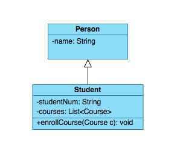

学生是人，学生继承人，在父类中定义了人共有的变量和方法，子类继承父类，也就继承了变量和方法，也可以增加新变量和新方法或重写(override)方法来实现子类特有的功能。

## 实现关系(Realization)

实现关系是指类实现了接口，接口中声明了抽象的方法，实现类中实现了具体的方法。在UML图中，实现用带空心三角形的虚线表示。

实现接口在Java中用关键字`implement`来表示。

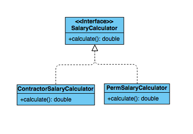

在接口中只有抽象的方法（当然Java 8以后也可以有具体的实现，default方法，这里就不展开说了），没有定义变量，而实现类必须要实现继承的接口中的所有方法。

ContractorSalary和PermSalary的必须要实现接口中抽象的方法`calculate()`，它们计算工资的方法不一样，当然，在实现类中，也可以增加自己的变量和方法。

其实实现关系也是一种`is-a`的关系，和继承关系的区别在于，一个是继承类，一个是实现接口。

## 依赖关系(Dependency)

依赖关系是类与类之间的弱联系，通常是表示使用关系。大多数情况下，依赖关系体现在某个类的方法使用了另一个类的对象作为参数。在UML图中，依赖关系用三角箭头的虚线表示。

上面的例子中没有依赖关系。但是依赖关系非常常见。

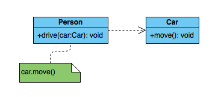

上图中，Person类中的`drive`方法中将Car对象传入，也就是Person类依赖于Car类。

依赖关系通常通过三种方式来实现：

1. 将一个类的对象作为另一个类中方法的参数
2. 在一个类的方法中将另一个类的对象作为局部变量
3. 在一个类的方法中调用另一个类的静态方法

## 聚合关系(Aggregation)

聚合关系表示整体与部分的关系。在聚合关系中，成员是整体的一部分，但是成员可以脱离整体独立存在，也就是整体和部分的生命周期是不一样的。在UML图中，聚合关系用带空心菱形的实线表示。

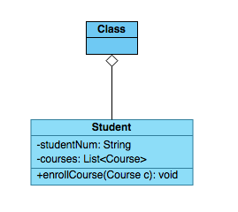

譬如班级是由学生组成的，但是学生可以脱离班级独立存在，即使班级不存在了，学生还是可以存在。

生活中有非常广泛的例子可以说明聚合关系，譬如电脑由鼠标、键盘、显示器等组成，鼠标、键盘、显示器都是可以脱离电脑单独存在的。

## 组合关系(Composition)

组合关系也是表示整体与部分的关系，但是和聚合关系不同的是，组合关系要求整体和部分的生命周期是一样的，整体不存在了，部分也不存在了。在UML图中，组合关系用实心菱形的实线表示。

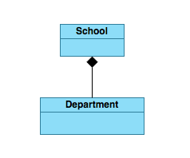

学校不在的话，自然学系也不在了。

## 关联关系(Association)

关联关系是用来描述不同类的对象之间的结构关系，表示两个类的对象之间有关联。在UML图中，用实线来表示关联关系。这种关系是一种强关联，通常将一个类的对象作为另一个类的成员变量。

关联关系又分单向关联、双向关联、自关联

### 双向关联

默认情况下，关联是双向的，表示类的对象之间是相互知道的，所以也不需要强调方向，实线上不需要标注箭头。

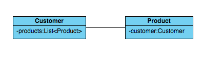

### 单向关联

如果特别强调方向，如下图，表示A知道B，但B不知道A，通常是`has-a`的意思，A has-a B， 则用带有箭头的实线表示。

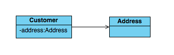

### 自关联

有一种特殊的关联关系，就是一个类的成员变量类型为该类本身，这种关系叫自关联。

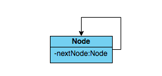

## 聚合关系、组合关系、关联关系的区别

实际上如果看具体的代码实现，是不能区分聚合关系、组合关系和关联关系的。我们只能从具体的类之间的语义联系以及类的生命周期来区分三者之间的关系。

聚合关系和组合关系的区别在于：聚合关系中部分类和整体类的生命周期是不一致的，而组合关系要求部分类和整体类的生命周期是一致的。

聚合关系、组合关系和关联关系的区别在于：聚合关系以及组合关系中，类与类之间是从属关系，而关联关系中，类与类之间的关系是对等的。

不过在实际应用中，你会发现这三种关系有时候会傻傻分不清楚，所以也不要死扣细节，活学活用就好了。